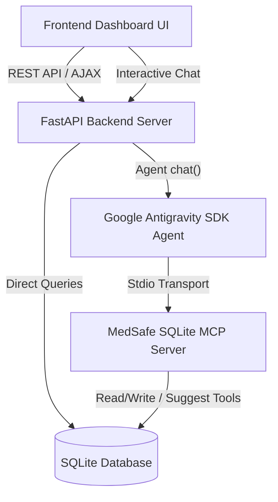

# MedSafe AI

> **Kaggle 5-Day AI Agents Capstone Project Submission**  
> **Track:** Concierge Agents  
> **Theme:** Local-First, Privacy-First Medication Scheduling & Clinical Safety Assistant

MedSafe AI is an empathetic personal health companion designed to help users manage complex medication schedules, track daily compliance, log symptoms, and scan for safety conflicts.

Because medical history is highly sensitive, MedSafe AI is built on a **local-first, privacy-first architecture**. It stores all records locally on your machine in an SQLite database accessed securely through a custom Model Context Protocol (MCP) server. Sensitive health details are processed locally, ensuring records never leave the user's computer.

---

## Key Features

### 1. Smart Medication Scheduling & Checklist
- Natural language schedule entry (e.g., *"I need to take Lisinopril 10mg every morning"*), which the agent automatically structures and logs.
- Interactive daily checklist to check off or skip doses, building a compliance history.

### 2. Proactive Drug & Allergy Safety Checks
- **Allergy Warnings:** Cross-checks any new medication request against the user's registered allergy profile (e.g., flagging *Amoxicillin* if the user has a *Penicillin* allergy).
- **Drug-Drug Interactions:** Uses local clinical guidelines to identify dangerous combinations (e.g., flagging the bleeding risks of taking *Aspirin* while on blood thinners like *Warfarin*).
- **Override Warning Modal:** Prompts the user with a modal explaining warnings in detail before letting them confirm or cancel scheduling.

### 3. Empathetic Symptom Logging & Correlation
- Log physical symptoms (e.g., *"dizzy after lunch, severity 6/10"*) via chat or form.
- Correlates symptoms directly with specific medication doses to track side effects over time.
- **Dynamic Correlation Chart:** A dual-axis timeline graph showing the correlation between doses taken (bar chart) and average symptom severity (line graph).

### 4. Symptom-to-Medicine Lookup & Suggestions
- Query symptoms (e.g., *headache*, *cough*, *acid reflux*) directly via a dedicated lookup widget or natural language chat.
- Recommends basic medications mapped in local clinical guidelines.
- **Clinical Warning Disclaimer:** Prominently highlights safety notes enforcing doctor prescription verification before taking any suggested drugs.

### 5. Formatted Doctor Reports
- Synthesizes medication adherence rate, allergy profile, recent symptom logs, and full intake history into a clean report.
- Includes custom print stylesheets (`@media print`) so the patient can print a physical clinical summary sheet for their next doctor visit.

---

## Technical Architecture

The application is structured as a full-stack, local-first multi-agent system:



---

## Kaggle Capstone Criteria Met

| Course Concept | Implementation in MedSafe AI | File Location |
| :--- | :--- | :--- |
| **Agent / Multi-agent (ADK)** | Coordinator agent config using `google.antigravity.Agent` and `LocalAgentConfig` to parse inputs, coordinate workflows, chat with users, and suggest medications. | `backend/medsafe_agent.py` |
| **MCP Server** | A custom `FastMCP` server running over local standard input/output (stdio) transport, exposing secure database access and clinical suggestion tools to the agent. | `backend/mcp_server.py` |
| **Security & Privacy** | Clinical safety checks, allergy warnings, and symptom suggestions run entirely on local databases. No API keys or credentials are stored or shared. | `backend/database.py` |
| **Robust Offline Fallback** | Integrates a local keyword and regex parsing engine that acts as the agent if no Gemini API Key is present, ensuring the app is always functional. | `backend/medsafe_agent.py` |

---

## Repository Structure

```
├── backend/
│   ├── database.py               # SQLite schema definition and seed data
│   ├── clinical_guidelines.json  # Local drug interactions, allergy classes, and symptom-medicine mappings
│   ├── mcp_server.py             # Custom FastMCP server exposing database and suggestion tools
│   ├── medsafe_agent.py          # Antigravity Agent and rule-based fallback processor
│   ├── main.py                   # FastAPI REST server serving static files and API routes
│   └── medsafe.db                # SQLite Database file (created on startup)
├── frontend/
│   ├── index.html                # Dashboard markup (checklist, tracker, lookup, and chat views)
│   ├── styles.css                # Custom CSS styling (dark mode, glassmorphic layout)
│   └── app.js                    # Client UI controller and API integration
└── README.md                     # Project documentation
```

---

## Setup & Running Locally

### Prerequisites

Ensure you have **Python 3.10+** installed, then install the necessary dependencies:

```bash
pip install fastapi uvicorn mcp google-antigravity
```

### Running the Application

**1. Start the FastAPI Server:**

```bash
python3 backend/main.py
```

> This automatically initializes the SQLite database schema and seeds sample profiles on startup.

**2. Access the Dashboard:**

Open your browser and navigate to:

```
http://localhost:8000
```

### Optional: Running with Gemini API Key

To run with the live Google Antigravity Agent, set your API key in the environment before starting the server:

```bash
export GEMINI_API_KEY="your-api-key-here"
python3 backend/main.py
```

If the environment variable is not set, MedSafe AI **gracefully falls back to its offline parsing processor**, meaning all features — checklist, forms, safety warning alerts, symptom tracking, symptom lookup, and dashboard navigation — remain fully operational and testable.
