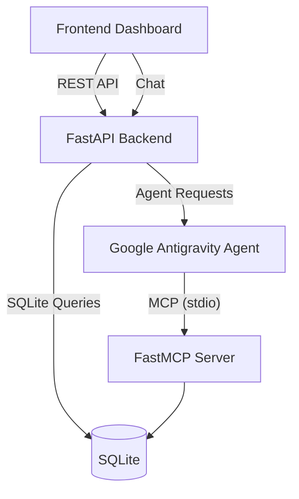

# 💊 MedSafe AI

> **Kaggle 5-Day AI Agents Capstone Project**
> **Track:** Concierge Agents
> **Theme:** Local-First, Privacy-First Medication Management & Clinical Safety Assistant

---

## 📌 Overview

**MedSafe AI** is an AI-powered healthcare companion that helps users safely manage medications, monitor treatment adherence, track symptoms, and detect potential clinical risks.

Unlike cloud-based health assistants, **all sensitive medical information remains on the user's device**.

The application follows a **Local-First + Privacy-First** architecture where medication records, symptom history, allergies, and clinical data are stored securely in a local SQLite database and accessed through a custom **Model Context Protocol (MCP)** server.

No patient records are uploaded to external servers.

---

# ✨ Features

## 💊 Smart Medication Scheduling

* Add medications using natural language

Example:

> "Take Lisinopril 10mg every morning"

The AI automatically extracts:

* Medication name
* Dosage
* Schedule
* Frequency

and saves everything into the local database.

### Daily Medication Checklist

* Mark doses as completed
* Skip missed doses
* Track medication adherence history

---

## 🛡️ Clinical Safety Checks

Before scheduling any medication, MedSafe AI automatically performs safety validation.

### Allergy Detection

Example:

```
User Allergy:
Penicillin

Medication:
Amoxicillin
```

The assistant immediately warns the user before allowing scheduling.

---

### Drug Interaction Detection

The local clinical guideline database detects dangerous combinations.

Example:

* Aspirin + Warfarin
* Increased bleeding risk

Users receive an interactive warning dialog before confirming.

---

## 📈 Symptom Tracking

Users can log symptoms naturally.

Example:

```
Dizzy after lunch
Severity: 6/10
```

Every symptom entry is linked to nearby medication doses to help identify possible side effects.

---

## 📊 Medication vs Symptom Correlation

The dashboard includes a dual-axis timeline visualization showing:

* Medication doses taken (Bar Chart)
* Average symptom severity (Line Chart)

This helps users and healthcare professionals identify treatment patterns.

---

## 💡 Symptom → Medication Lookup

Users can search symptoms such as:

* Headache
* Fever
* Cough
* Acid reflux

The assistant recommends commonly used medications from the local clinical guidelines while displaying a clear clinical disclaimer encouraging consultation with a healthcare professional.

---

## 📄 Doctor Visit Report

Generate a printable clinical summary including:

* Medication adherence rate
* Current medications
* Allergy profile
* Symptom history
* Medication timeline
* Recent side effects

A custom `@media print` stylesheet ensures the report prints cleanly for doctor appointments.

---

# 🔒 Privacy First

Healthcare information is highly sensitive.

MedSafe AI was designed so patient data never leaves the local machine.

### Stored Locally

* Medication schedule
* Symptom logs
* Allergy profile
* Compliance history
* Clinical notes

### Never Sent Online

* Medical history
* Personal health information
* Database records

---

# 🏗️ Architecture



---

# 🤖 AI Agent Workflow

```text
User Request
      │
      ▼
FastAPI Backend
      │
      ▼
Google Antigravity Agent
      │
      ▼
FastMCP Server
      │
      ▼
SQLite Database
      │
      ▼
Clinical Safety Validation
      │
      ▼
Response Returned
```

---

# 📁 Project Structure

```text
MedSafe-AI
│
├── backend/
│   ├── database.py
│   ├── clinical_guidelines.json
│   ├── mcp_server.py
│   ├── medsafe_agent.py
│   ├── main.py
│   └── medsafe.db
│
├── frontend/
│   ├── index.html
│   ├── styles.css
│   └── app.js
│
└── README.md
```

---

# 🛠️ Technology Stack

| Component | Technology             |
| --------- | ---------------------- |
| Backend   | FastAPI                |
| AI Agent  | Google Antigravity SDK |
| MCP       | FastMCP                |
| Database  | SQLite                 |
| Frontend  | HTML, CSS, JavaScript  |
| Charts    | Chart.js               |
| Storage   | Local SQLite           |

---

# 🎯 Kaggle Capstone Requirements

| Requirement          | Implementation                                            |
| -------------------- | --------------------------------------------------------- |
| AI Agent             | Google Antigravity Agent                                  |
| MCP Server           | Custom FastMCP Server                                     |
| Local Tool Calling   | SQLite via MCP                                            |
| Offline Support      | Rule-based fallback processor                             |
| Privacy              | Local-only storage                                        |
| Multi-step Workflows | Medication scheduling, symptom logging, safety validation |

---

# 🚀 Getting Started

## Prerequisites

* Python 3.10+
* pip

Install dependencies:

```bash
pip install fastapi uvicorn mcp google-antigravity
```

---

## Run the Application

Start the backend server:

```bash
python backend/main.py
```

The application automatically:

* Creates the SQLite database
* Seeds sample data
* Starts the FastAPI server

Open:

```
http://localhost:8000
```

---

# 🌐 Optional: Enable Gemini

To use the live Google Antigravity Agent:

```bash
export GEMINI_API_KEY="YOUR_API_KEY"

python backend/main.py
```

If no API key is provided, MedSafe AI automatically switches to its offline rule-based engine, allowing all major features—including medication scheduling, symptom logging, safety validation, and dashboard interactions—to continue working without internet access.

---

# 📷 Application Preview

> Add your screenshots below.

### Dashboard


### Medication Checklist


### Drug Interaction Warning


### Symptom Correlation Chart


### Doctor Report


---

# 🌟 Highlights

* ✅ Local-First Architecture
* ✅ Privacy by Design
* ✅ AI Agent + MCP Integration
* ✅ Offline Functionality
* ✅ Clinical Safety Checks
* ✅ Drug Interaction Detection
* ✅ Allergy Validation
* ✅ Symptom Correlation Analytics
* ✅ Printable Doctor Reports

---

# 📜 License

This project was developed as part of the **Kaggle 5-Day Generative AI Intensive Course Capstone**.

For educational and demonstration purposes only.

**Disclaimer:** MedSafe AI is not a substitute for professional medical advice, diagnosis, or treatment. Always consult a qualified healthcare professional before starting, stopping, or changing any medication.
