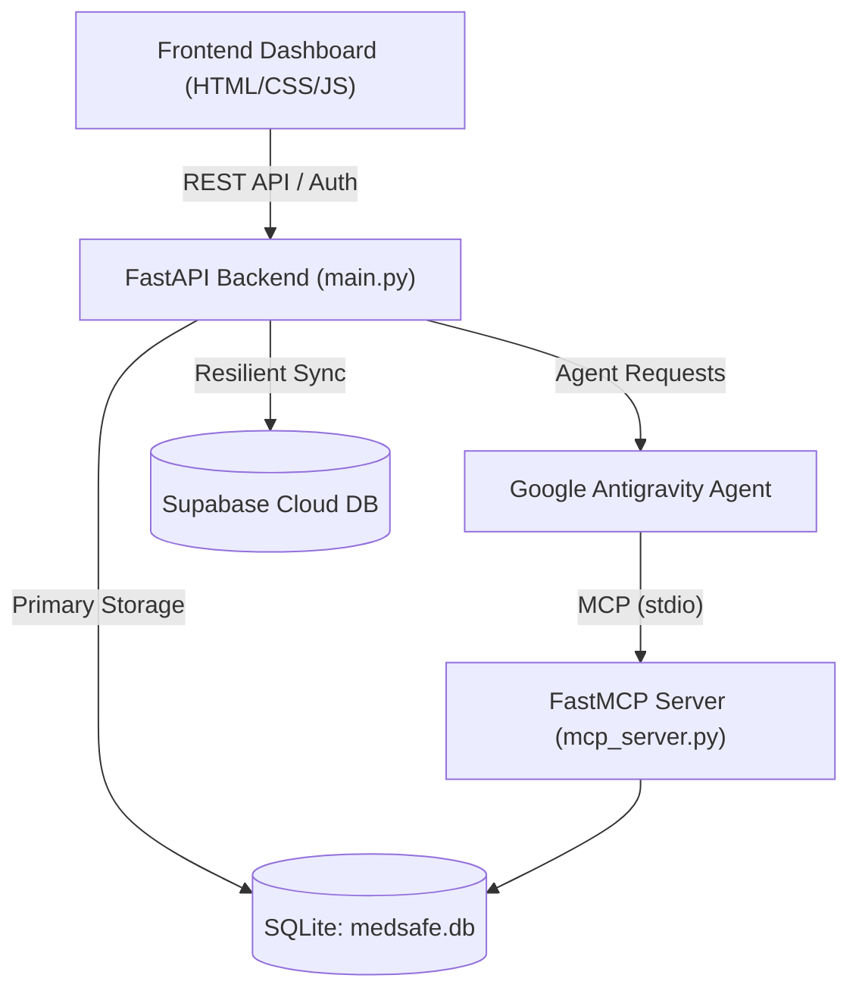

# 💊 MedSafe AI - Privacy, Medication Management & Clinical Safety Assistant

> **Kaggle 5-Day AI Agents Capstone Project**  
> **Track:** Concierge Agents  
> **Theme:** Local-First, Privacy-First Medication Management & Clinical Safety Assistant  
> **Live Deployment:** [https://medsafe-ai-pi.vercel.app](https://medsafe-ai-pi.vercel.app)  
> **GitHub Repository:** [https://github.com/GODSON008/MEDSAFE-AI](https://github.com/GODSON008/MEDSAFE-AI)  

---

## 📌 Overview

**MedSafe AI** is an AI-powered healthcare companion that helps users safely manage medications, monitor treatment adherence, track symptoms, and detect potential clinical risks.

Unlike cloud-only health assistants, **MedSafe AI** features a **Hybrid Local-First + Resilient Cloud Architecture**:
- All primary medication records, symptom logs, allergies, and clinical data are stored locally in a high-performance **SQLite database** (`medsafe.db`) accessed via a custom **Model Context Protocol (MCP)** server.
- Optional remote cloud synchronization to **Supabase** ensures cross-device persistence across serverless platforms (like **Vercel**).
- **Resilient Fallback**: If Supabase is paused, offline, or unavailable, MedSafe AI automatically operates seamlessly in standalone local mode without blocking user actions or throwing runtime exceptions.

---

## 🚀 Live Demo & Repository Links

- 🌐 **Live Website (Vercel)**: [https://medsafe-ai-pi.vercel.app](https://medsafe-ai-pi.vercel.app)
- 🐙 **GitHub Codebase**: [https://github.com/GODSON008/MEDSAFE-AI](https://github.com/GODSON008/MEDSAFE-AI)
- 🗄️ **Supabase SQL Schema**: [`supabase_schema.sql`](file:///Users/herambkrishnaarora/Desktop/kaggle%20capstone/supabase_schema.sql)

---

# ✨ Features

## 💊 Smart Medication Scheduling

* Add medications using natural language

Example:

> "Take Lisinopril 10mg every morning"

The AI automatically extracts:

* Medication name
* Dosage
* Schedule
* Frequency

and saves everything into the database.

### Daily Medication Checklist

* Mark doses as completed
* Skip missed doses
* Track medication adherence history

---

## 🛡️ Clinical Safety Checks

Before scheduling any medication, MedSafe AI automatically performs safety validation.

### Allergy Detection

Example:

```
User Allergy: Penicillin
Medication: Amoxicillin
```

The assistant immediately warns the user before allowing scheduling.

---

### Drug Interaction Detection

The local clinical guideline database detects dangerous combinations.

Example:

* Aspirin + Warfarin
* Increased bleeding risk

Users receive an interactive warning dialog before confirming.

---

## 📈 Symptom Tracking & Side Effect Correlation

Users can log symptoms naturally (e.g., *"Dizzy after lunch, Severity: 6/10"*).
* Every symptom entry is linked to nearby medication doses.
* The dashboard features a dual-axis timeline visualization showing medication doses vs average symptom severity to spot treatment patterns.

---

## 💡 Symptom → Medication Lookup & Generic Pricing

* Search common symptoms (e.g. *Headache, Fever, Cough, Acid Reflux*).
* Get recommended medications from clinical guidelines with disclaimer.
* Compare generic vs brand-name medication prices across pharmacy sources (Apollo Pharmacy, MedPlus).

---

## 📄 Doctor Visit Report

Generate a printable clinical summary including:

* Medication adherence rate
* Current medications & allergy profile
* Symptom history & medication timeline
* Recent side effects

---

## 📄 Secure Document Vault & Local OCR

* Upload blood tests, lab reports, and medical records.
* Native macOS local OCR extraction via `ocr.swift` using Apple's Vision framework.
* Analyzes lab report metrics using AI clinical guidelines.

---

# 🏗️ Architecture


```mermaid
graph TD

UI["Frontend Dashboard (HTML/CSS/JS)"]

UI -->|"REST API / Auth"| FastAPI["FastAPI Backend (main.py)"]

FastAPI -->|"Agent Requests"| Agent["Google Antigravity Agent"]

FastAPI -->|"Primary Storage"| DB[(SQLite: medsafe.db)]

FastAPI -->|"Resilient Sync"| Supabase[(Supabase Cloud DB)]

Agent -->|"MCP (stdio)"| MCP["FastMCP Server (mcp_server.py)"]

MCP --> DB
```

### Kaggle Capstone Criteria Met

| Course Concept | Implementation in MedSafe AI | File Location |
| :--- | :--- | :--- |
| **Agent / Multi-agent (ADK)** | Coordinator agent config using `google.antigravity.Agent` and `LocalAgentConfig` to parse inputs, coordinate workflows, and evaluate clinical safety. | [`backend/medsafe_agent.py`](file:///Users/herambkrishnaarora/Desktop/kaggle%20capstone/backend/medsafe_agent.py) |
| **MCP Server** | A custom `FastMCP` server running over local stdio transport, exposing secure database access and clinical suggestion tools to the agent. | [`backend/mcp_server.py`](file:///Users/herambkrishnaarora/Desktop/kaggle%20capstone/backend/mcp_server.py) |
| **Security & Privacy** | Clinical safety checks, allergy warnings, and symptom suggestions run on local guidelines. | [`backend/database.py`](file:///Users/herambkrishnaarora/Desktop/kaggle%20capstone/backend/database.py) |
| **Resilient Supabase Sync** | Auto-detects paused or offline Supabase instances, switching seamlessly to local SQLite storage. | [`backend/supabase_client.py`](file:///Users/herambkrishnaarora/Desktop/kaggle%20capstone/backend/supabase_client.py) |
| **Local OCR Engine** | Utilizes Apple's native Vision framework via a custom Swift script (`ocr.swift`) to parse image text. | [`backend/ocr.swift`](file:///Users/herambkrishnaarora/Desktop/kaggle%20capstone/backend/ocr.swift) |
| **Vercel Serverless Build** | Serverless deployment via Vercel Python runtime and static frontend routing. | [`vercel.json`](file:///Users/herambkrishnaarora/Desktop/kaggle%20capstone/vercel.json) |

---

# 📁 Project Structure

```text
MedSafe-AI
│
├── backend/
│   ├── database.py              # SQLite schema definition and seed data
│   ├── clinical_guidelines.json # Local drug interactions, allergy classes, and symptom-medicine mappings
│   ├── mcp_server.py            # Custom FastMCP server exposing database and suggestion tools
│   ├── medsafe_agent.py         # Antigravity Agent and rule-based fallback processor
│   ├── main.py                  # FastAPI REST server serving static files and API routes
│   ├── supabase_client.py       # Resilient Supabase database sync client with auto-fallback
│   ├── pharmacy_finder.py       # Pharmacy pricing comparison helper
│   ├── ocr.swift                # Native macOS OCR script for local text extraction
│   └── medsafe.db               # Local SQLite Database file
├── frontend/
│   ├── index.html               # Dashboard markup (checklist, tracker, lookup, and chat views)
│   ├── styles.css               # Custom CSS styling (dark mode, glassmorphic layout)
│   ├── typography.css           # Unified typography tokens
│   └── app_v3.js                # Client UI controller and API integration
├── supabase_schema.sql          # SQL Schema setup script for Supabase database tables
├── vercel.json                  # Vercel deployment configuration
└── README.md                    # Project documentation
```

---

# 🛠️ Database & Supabase Setup

### 1. Local SQLite Database
The app automatically initializes `medsafe.db` on startup when running locally or on serverless cold starts.

### 2. Supabase Cloud Database (Optional Sync)
If using Supabase cloud persistence:
1. Open your [Supabase SQL Editor](https://supabase.com/dashboard).
2. Execute the DDL script in [`supabase_schema.sql`](file:///Users/herambkrishnaarora/Desktop/kaggle%20capstone/supabase_schema.sql) to create `users`, `doctor_patients`, and `lab_reports` tables.
3. Configure environment variables in `.env`:
```env
SUPABASE_URL=https://your-project.supabase.co
SUPABASE_KEY=your-supabase-anon-key
```

---

# 💻 Running Locally

1. Install dependencies:
```bash
pip install -r requirements.txt
```

2. Start the application:
```bash
python3 backend/main.py
```

3. Open in browser:  
[http://localhost:8000](http://localhost:8000)

---

# 🚀 Deployment to Vercel

To deploy updates to Vercel:
```bash
npx vercel --prod
```
The site will build using `@vercel/python` for the backend API and `@vercel/static` for the frontend interface.
