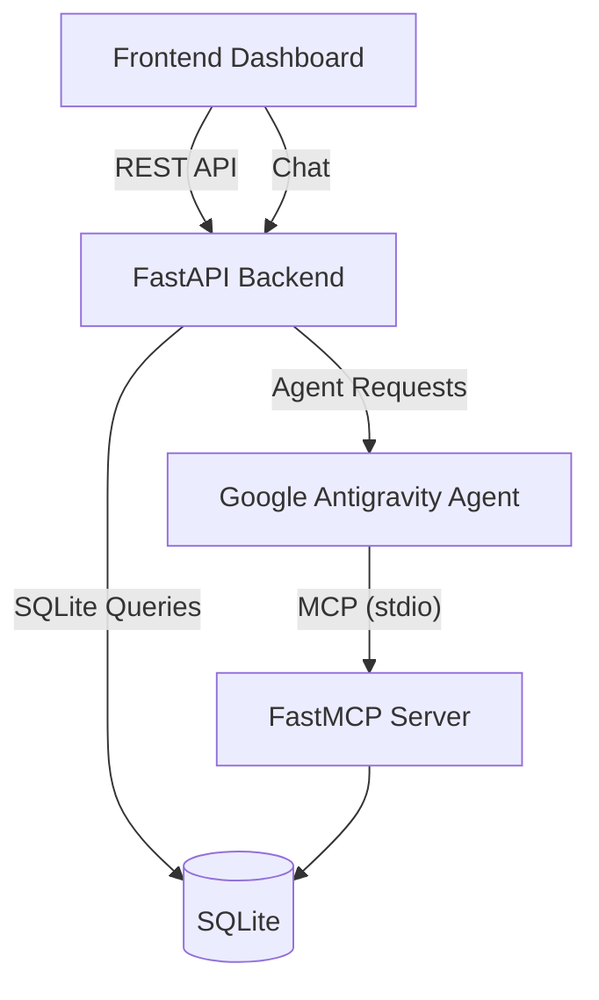

# 💊 MedSafe AI - Privacy , Medication Management & Clinical Safety Assistant

> **Kaggle 5-Day AI Agents Capstone Project**
> **Track:** Concierge Agents
> **Theme:** Local-First, Privacy-First Medication Management & Clinical Safety Assistant

---

## 📌 Overview

**MedSafe AI** is an AI-powered healthcare companion that helps users safely manage medications, monitor treatment adherence, track symptoms, and detect potential clinical risks.

Unlike cloud-based health assistants, **all sensitive medical information remains on the user's device**.

The application follows a **Local-First + Privacy-First** architecture where medication records, symptom history, allergies, and clinical data are stored securely in a local SQLite database and accessed through a custom **Model Context Protocol (MCP)** server.

No patient records are uploaded to external servers.

6. **Secure Local Document Vault**
   - Securely upload and store lab reports, blood tests, and medical records of all file types locally.
   - Access and download stored reports directly from your dashboard history with strict patient access controls.

---

# ✨ Features

## 💊 Smart Medication Scheduling

* Add medications using natural language

Example:

> "Take Lisinopril 10mg every morning"

The AI automatically extracts:

* Medication name
* Dosage
* Schedule
* Frequency

and saves everything into the local database.

### Daily Medication Checklist

* Mark doses as completed
* Skip missed doses
* Track medication adherence history

---

## 🛡️ Clinical Safety Checks

Before scheduling any medication, MedSafe AI automatically performs safety validation.

### Allergy Detection

Example:

```
User Allergy:
Penicillin

Medication:
Amoxicillin
```

The assistant immediately warns the user before allowing scheduling.

---

### Drug Interaction Detection

The local clinical guideline database detects dangerous combinations.

Example:

* Aspirin + Warfarin
* Increased bleeding risk

Users receive an interactive warning dialog before confirming.

---

## 📈 Symptom Tracking

Users can log symptoms naturally.

Example:

```
Dizzy after lunch
Severity: 6/10
```

Every symptom entry is linked to nearby medication doses to help identify possible side effects.

---

## 📊 Medication vs Symptom Correlation

The dashboard includes a dual-axis timeline visualization showing:

* Medication doses taken (Bar Chart)
* Average symptom severity (Line Chart)

This helps users and healthcare professionals identify treatment patterns.

---

## 💡 Symptom → Medication Lookup

Users can search symptoms such as:

* Headache
* Fever
* Cough
* Acid reflux

The assistant recommends commonly used medications from the local clinical guidelines while displaying a clear clinical disclaimer encouraging consultation with a healthcare professional.

---

## 📄 Doctor Visit Report

Generate a printable clinical summary including:

* Medication adherence rate
* Current medications
* Allergy profile
* Symptom history
* Medication timeline
* Recent side effects

A custom `@media print` stylesheet ensures the report prints cleanly for doctor appointments.

---

# 🔒 Privacy First

Healthcare information is highly sensitive.

MedSafe AI was designed so patient data never leaves the local machine.

### Stored Locally

* Medication schedule
* Symptom logs
* Allergy profile
* Compliance history
* Clinical notes

### Never Sent Online

* Medical history
* Personal health information
* Database records

---

# 🏗️ Architecture


```mermaid
graph TD

UI["Frontend Dashboard"]

UI -->|"REST API"| FastAPI["FastAPI Backend"]

UI -->|"Chat"| FastAPI

FastAPI -->|"Agent Requests"| Agent["Google Antigravity Agent"]

FastAPI -->|"SQLite Queries"| DB[(SQLite)]

Agent -->|"MCP (stdio)"| MCP["FastMCP Server"]

MCP --> DB
```

### Kaggle Capstone Criteria Met

| Course Concept | Implementation in MedSafe AI | File Location |
| :--- | :--- | :--- |
| **Agent / Multi-agent (ADK)** | Coordinator agent config using `google.antigravity.Agent` and `LocalAgentConfig` to parse inputs, coordinate workflows, chat with users, and suggest medications. | [`backend/medsafe_agent.py`](file:///Users/herambkrishnaarora/Desktop/kaggle%20capstone/backend/medsafe_agent.py) |
| **MCP Server** | A custom `FastMCP` server running over local standard input/output (stdio) transport, exposing secure database access and clinical suggestion tools to the agent. | [`backend/mcp_server.py`](file:///Users/herambkrishnaarora/Desktop/kaggle%20capstone/backend/mcp_server.py) |
| **Security & Privacy** | Clinical safety checks, allergy warnings, and symptom suggestions run entirely on local databases. No API keys or credentials are stored or shared. | [`backend/database.py`](file:///Users/herambkrishnaarora/Desktop/kaggle%20capstone/backend/database.py) |
| **Robust Offline Fallback** | Integrates a local keyword and regex parsing engine that acts as the agent if no Gemini API Key is present, ensuring the app is always functional. | [`backend/medsafe_agent.py`](file:///Users/herambkrishnaarora/Desktop/kaggle%20capstone/backend/medsafe_agent.py) |
| **Local OCR Engine** | Utilizes Apple's native Vision framework via a custom Swift script (`ocr.swift`) to parse image text. On non-macOS platforms, this degrades gracefully. | [`backend/ocr.swift`](file:///Users/herambkrishnaarora/Desktop/kaggle%20capstone/backend/ocr.swift) |
| **Security & Hardening** | In-memory API rate limiter, strict CORS controls, case-preserving safety matches, and HMAC cryptographically-signed download tokens. | [`backend/main.py`](file:///Users/herambkrishnaarora/Desktop/kaggle%20capstone/backend/main.py) |

---

# 🤖 AI Agent Workflow

```text
User Request
      │
      ▼
FastAPI Backend
      │
      ▼
Google Antigravity Agent
      │
      ▼
FastMCP Server
      │
      ▼
SQLite Database
      │
      ▼
Clinical Safety Validation
      │
      ▼
Response Returned
```

---

# 📁 Project Structure

```text
MedSafe-AI
│
├── backend/
│   ├── database.py              # SQLite schema definition and seed data
│   ├── clinical_guidelines.json # Local drug interactions, allergy classes, and symptom-medicine mappings
│   ├── mcp_server.py            # Custom FastMCP server exposing database and suggestion tools
│   ├── medsafe_agent.py         # Antigravity Agent and rule-based fallback processor
│   ├── main.py                  # FastAPI REST server serving static files and API routes
│   ├── ocr.swift                # Native macOS OCR script for local text extraction
│   └── medsafe.db               # SQLite Database file (created on startup)
├── frontend/
│   ├── index.html               # Dashboard markup (checklist, tracker, lookup, and chat views)
│   ├── styles.css               # Custom CSS styling (dark mode, glassmorphic layout)
│   ├── typography.css           # Unified typography tokens
│   └── app_v3.js                # Client UI controller and API integration
└── README.md                    # Project documentation
```

---

# 🛠️ Technology Stack

| Component | Technology             |
| --------- | ---------------------- |
| Backend   | FastAPI                |
| AI Agent  | Google Antigravity SDK |
| MCP       | FastMCP                |
| Database  | SQLite                 |
| Frontend  | HTML, CSS, JavaScript  |
| Charts    | Chart.js               |
| Storage   | Local SQLite           |

* **Python 3.10+**
* **macOS (Optional for Local OCR)**: The local OCR parser leverages Apple's native Vision framework via `backend/ocr.swift` to extract text from chat image uploads. On Windows or Linux systems, the app continues to function perfectly and degrades gracefully by saving files as raw attachments without running local OCR.

```bash
pip install fastapi uvicorn mcp google-antigravity pypdf python-dotenv certifi
```

---

## Run the Application

Start the backend server:

### Optional: Running with Gemini API Key
To run with the live Google Antigravity Agent (for advanced conversational chat), add your API key in a `.env` file in the root folder:
```env
GEMINI_API_KEY=your-api-key-here
```
If the API key is not set, MedSafe AI **gracefully falls back to its offline parsing processor**, meaning all features (medication scheduling, checklist, symptom tracking, safety alerts, lookup, document vault, and dashboard navigation) remain fully operational and testable entirely locally.
